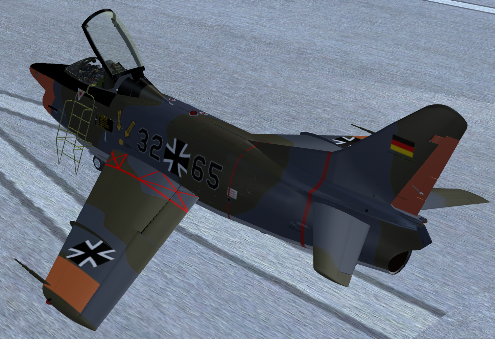

******************************
FlightGear G91-R Documentation
******************************

Welcome to the documentation of the `G91-R⇗ <https://en.wikipedia.org/wiki/Fiat_G.91>`_ for the `FlightGear⇗ <https://www.flightgear.org/>`_ open source flight simulator.

While there are many variants of the G91, this model is concentrating on the G91-R versions.

There are quite a number of ways to write the name of this plane, like G.91R, G91R, G91-R, G-91R, etc. We have chosen to use G91-R in this documentation and to not mention the original manufacorer Fiat, since the plane was also built under license in Germany by `Dornier⇗ <https://en.wikipedia.org/wiki/Dornier_Flugzeugwerke>`_ and in Portugal by `OGMA-Indústria Aeronáutica de Portugal⇗ <https://www.ogma.pt/>`_.

About this Manual
=================

The goal of this manual is to provide information about the systems and operation of the G91-R model in FlightGear. This manual is a companion to the ``G91-R4 Flight Manual - 1961.pdf`` which also can be found in the ``Docs`` folder og the model. Therefore, only what is not in the flight manual and/or is specific to FlightGear is described in this manual.

For handling generic controls in FlightGear like flaps etc. see also the common aircraft keys in the `official FG manual <https://flightgear.gitlab.io/getstart/release-2024.1/en/HTML/getstart-ench5.html#keyboard-controls>`_.

FlightGear Requirements
=======================

You need at least FlightGear version ``2024.1`` to run this model. ``ALS`` should be enabled and your computer should have a decent graphics card.

License
=======

This FlightGear G91-R model including its documentation is licensed with `GNU GPL⇗ <https://en.wikipedia.org/wiki/GNU_General_Public_License>`_ version 2. See the `licence information⇗ <https://github.com/5H1N0B11/flightgear-mirage2000/blob/master/Mirage-2000/COPYING>`_ in the repo.
